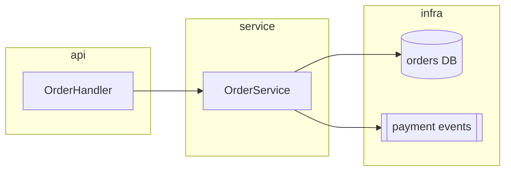

# Component Diagram (`flowchart` with subgraphs)

Collection rules below apply to traced diagrams only. For proposed diagrams, use the syntax and notation examples only.

Use subgraph flowcharts. Mermaid's `C4Context` is experimental and many renderers do not support it; use it only when the user requested C4 notation and the target renderer support is confirmed.

Evidence when asked: list nodes and edges with `file:line` citations.

- For each edge, record from-module, to-module, kind (import, call, wiring), and proof location `file:line`: import declaration, call site, or wiring registration. Collection is complete when every in-scope module's outgoing edges are listed.
- Seam evidence: if the question asks where seams are, cite each seam's interface definition, adapter implementation, and wiring site as `file:line`. If the question only asks about dependencies, say seams were not analyzed.
- Edges show dependency direction (import/call), not data flow. State which one the diagram shows.
- Group by the codebase's actual package/module structure, not an idealized structure. If the real structure is tangled, show it as tangled.
- If the `codebase-design` skill is available, use its vocabulary: module, interface, seam, adapter.
