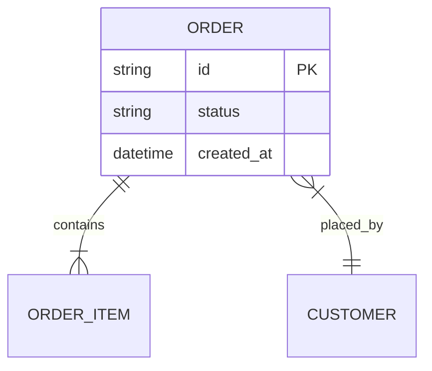

# ER Diagram (`erDiagram`)

Collection rules below apply to traced diagrams only. For proposed diagrams, use the syntax and notation examples only.

Derive entities and cardinality from schema definitions (migrations, ORM models, DDL), not from struct shape alone.

Evidence when asked: list entities and relationships with `file:line` citations.

- For each relationship, record the two entities, cardinality, defining constraint or field, and definition location `file:line`. Collection is complete when every in-scope entity's FKs and associations are covered.
- Include only fields relevant to the fixed question plus keys. Full column listing is the schema's job, not the diagram's.
