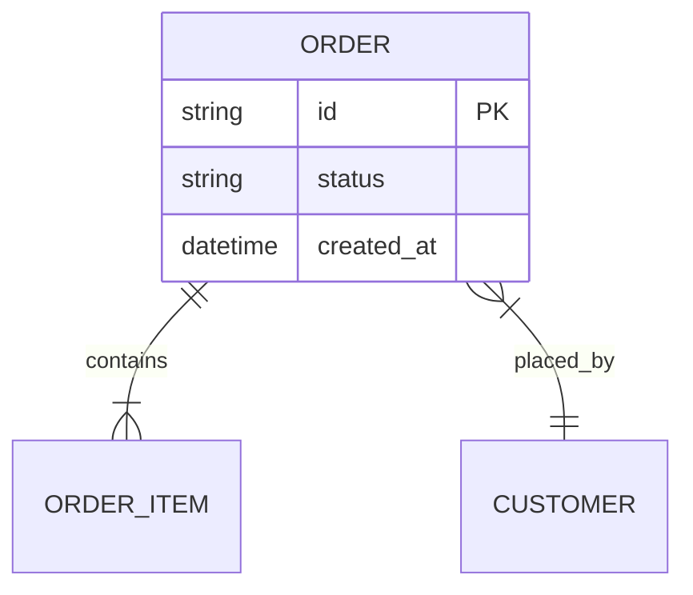

# ER Diagram (`erDiagram`)

## Notation

Evidence block contents: entities and relationships with `file:line` citations.

- Quote entity names that contain `?`, `(proposed)`, parentheses, brackets, colons, or spaces everywhere they appear, including relationship lines and entity blocks.
- Include only fields relevant to the fixed question plus keys. Full column listing is the schema's job, not the diagram's.

## Trace Completion

- Derive entities and cardinality from schema definitions (migrations, ORM models, DDL), not from struct shape alone.
- For each relationship, record the two entities, cardinality, defining constraint or field, and definition location `file:line`. Collection is complete when every in-scope entity's FKs and associations are covered.
