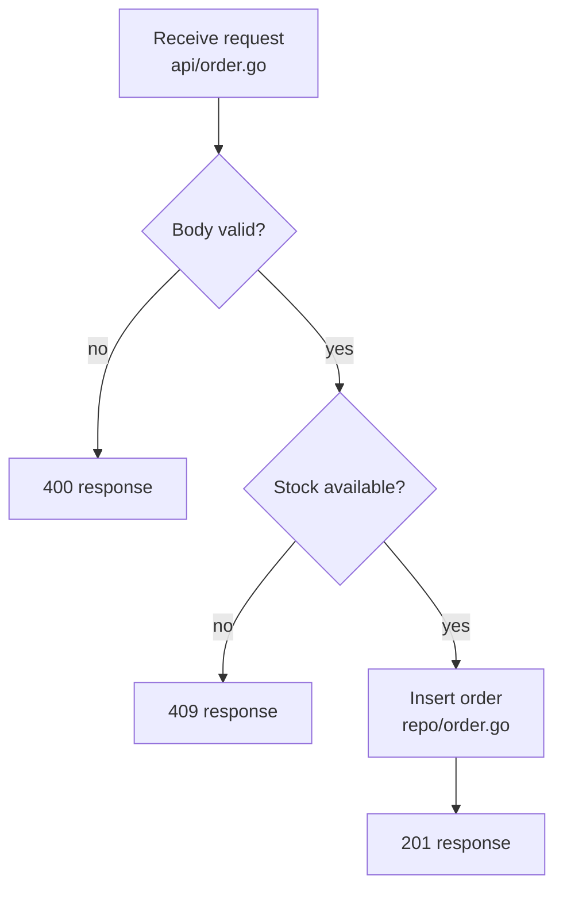

# Flowchart (`flowchart`)

## Notation

Evidence block contents: nodes, edges, and branch arms with `file:line` citations.

- Quote node labels that contain parentheses, brackets, or colons.

## Trace Completion

- Decision nodes `{}` correspond 1:1 with conditions in the trace record.
- Every leaf must be a terminal from the trace (response, commit, publish, exit). Do not leave dangling actions.
