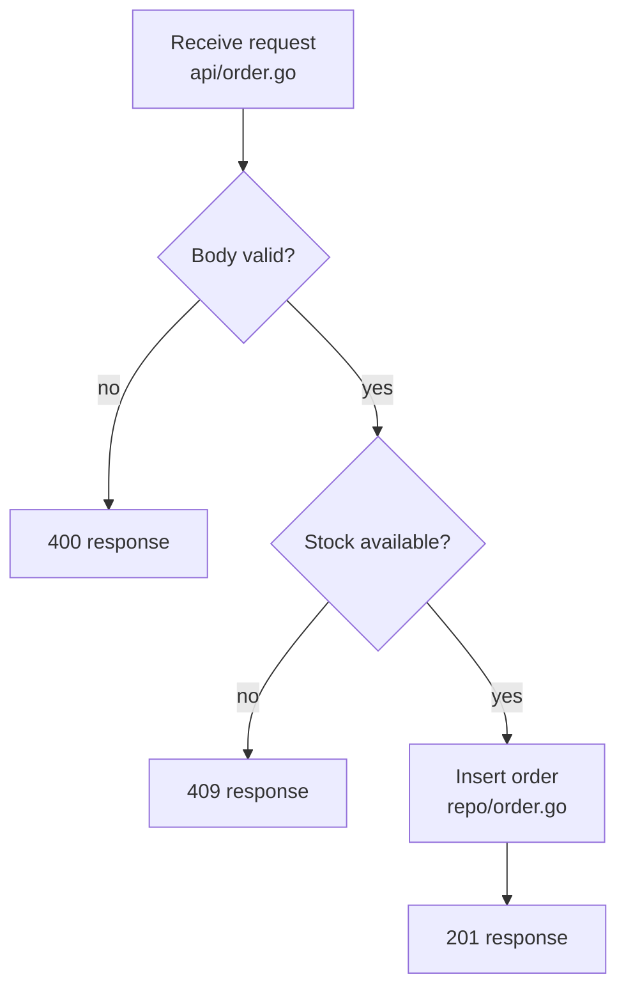

# Flowchart (`flowchart`)

Collection rules below apply to traced diagrams only. For proposed diagrams, use the syntax and notation examples only.

Evidence when asked: list nodes, edges, and branch arms with `file:line` citations.

- Decision nodes `{}` correspond 1:1 with conditions in the trace record.
- Default direction is `TD`; use `LR` when the flow is long and shallow.
- Every leaf must be a terminal from the trace (response, commit, publish, exit). Do not leave dangling actions.
