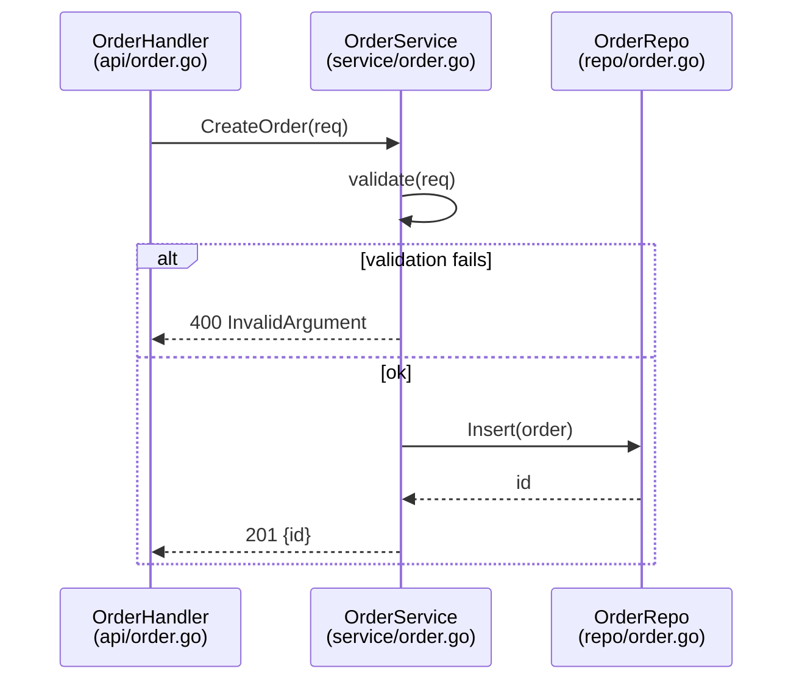

# Sequence Diagram (`sequenceDiagram`)

## Notation

Evidence block contents: participants, messages, branches, and returns with `file:line` citations.

- Participants are modules or services, not individual functions. Functions travel in message labels.
- Represent branches with `alt` / `opt` / `loop` blocks.
- Use `-->>` (dotted arrows) for returns and error responses.

## Trace Completion

- Every `alt` shows every arm found by the trace.
- Every edge, including `alt` arms, returns, and error responses, has a line in the trace record.
