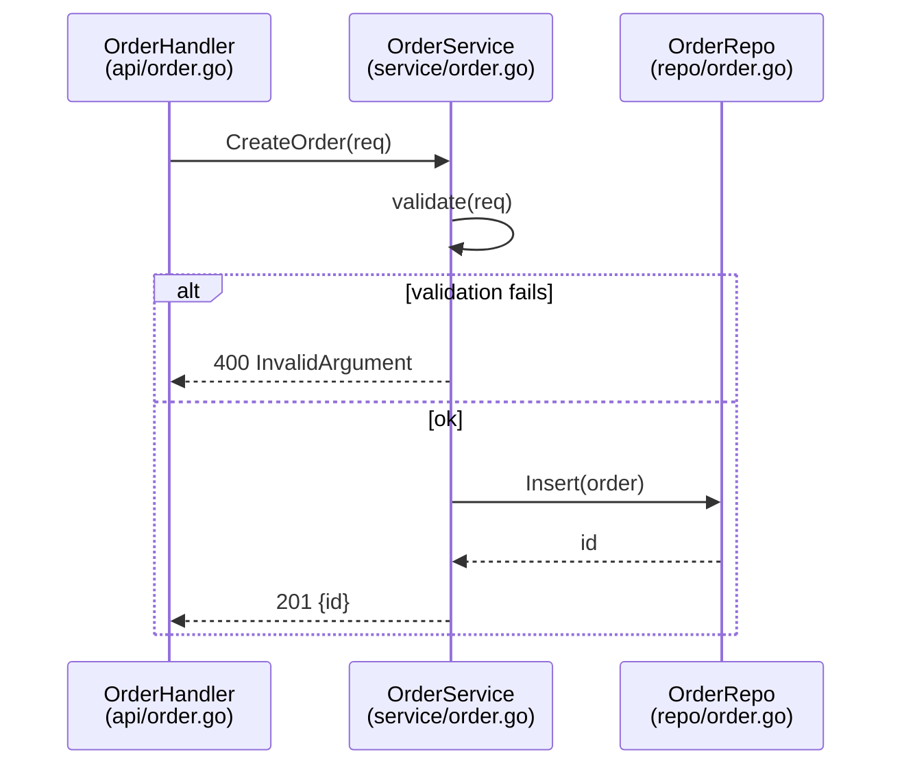

# Sequence Diagram (`sequenceDiagram`)

Collection rules below apply to traced diagrams only. For proposed diagrams, use the syntax and notation examples only.

Evidence when asked: list participants, messages, branches, and returns with `file:line` citations.

- Participants are modules or services, not individual functions. Functions travel in message labels.
- Represent branches from the trace record with `alt` / `opt` / `loop` blocks. Every `alt` shows every arm found by the trace.
- Use `-->>` (dotted arrows) for returns and error responses. Every edge, including `alt` arms, returns, and error responses, has a line in the trace record.
