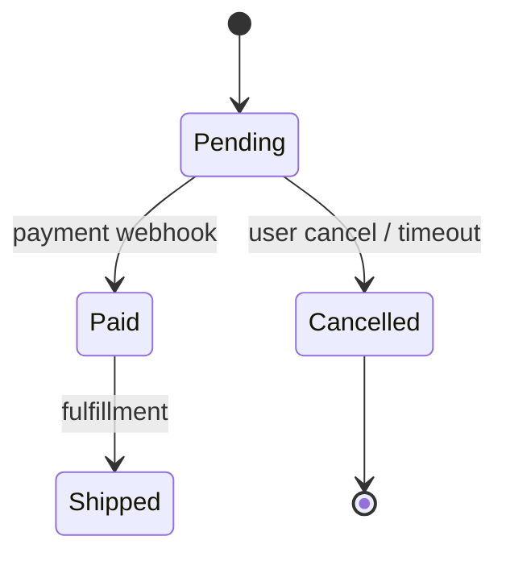

# State Diagram (`stateDiagram-v2`)

## Notation

Evidence block contents: states and transitions with `file:line` citations.

- For labels with `?`, `(proposed)`, parentheses, brackets, or colons, use Mermaid aliases: `state "Pending (proposed)" as pending`, then use `pending` in transitions. Do not write `"Pending (proposed)" --> Paid`.

## Trace Completion

- States come from actual enum/constants in code.
- For each transition, record from-state, to-state, trigger/condition, and write site `file:line`. Collection is complete when inbound/outbound transitions for every state constant have been checked.
- Do not invent transitions with no code path. Show states with neither inbound nor outbound transitions; they are often dead code or missed paths.
