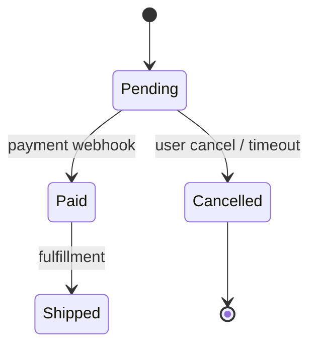

# State Diagram (`stateDiagram-v2`)

Collection rules below apply to traced diagrams only. For proposed diagrams, use the syntax and notation examples only.

States come from actual enum/constants in code.

Evidence when asked: list states and transitions with `file:line` citations.

- For each transition, record from-state, to-state, trigger/condition, and write site `file:line`. Collection is complete when inbound/outbound transitions for every state constant have been checked.
- Quote state labels that contain parentheses, brackets, or colons.
- Do not invent transitions with no code path. Show states with neither inbound nor outbound transitions; they are often dead code or missed paths.
